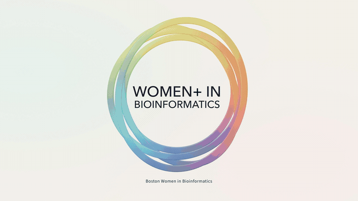
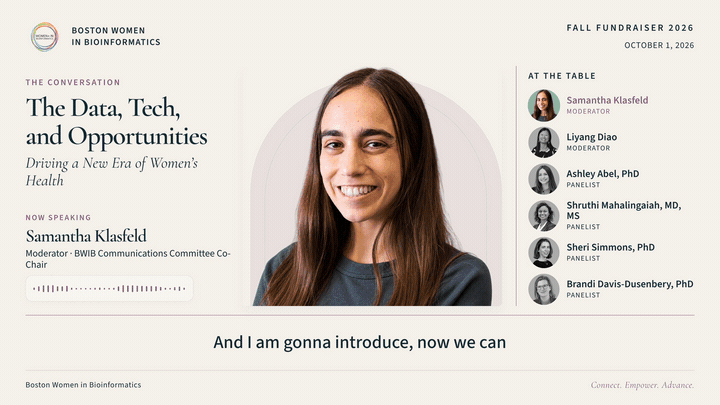

# BWIB Motion Kit

Reusable motion graphics from the Boston Women in Bioinformatics Fall Fundraiser.
This folder is a standalone project: copy its contents into a new GitHub repository.
It has no dependency on Trevor's computer, Resolve project, event footage or production folders.

## Template gallery

Short, silent loops from all five completed 4K designs.
[Jump to setup](#start) · [Higher-resolution stills](previews/README.md).

### Logo opener

Rotating multicolor rings settle into the BWIB logo for a reusable 6.4-second opening.


### Interview card

An animated guest introduction with an editable portrait, name, role and interview topic.


### Event and sponsors

A six-second event card with organizer branding and sponsor logos arranged by tier.



### A · Airy Stage

A six-person stage layout that highlights the active speaker in color while keeping
the full panel visible.


### C · Editorial Spotlight

A larger featured speaker beside a complete roster, with space for captions and
the audio waveform.



The panel GIFs are excerpts from the completed event videos, showing actual speaker
handoffs, captions and waveforms. Use your own edited recording and reviewed speaker
timings when adapting the templates.

## Completed templates

| Template | Purpose | Timing | Edit |
| --- | --- | --- | --- |
| `logo-opener` | Approved rotating multicolor ring logo reveal | 6.4 seconds, 30 fps | `templates/logo-opener/opener.js` |
| `interview-card` | Guest portrait, name, role and topic | 360 frames at 59.94 fps | `config/interview.json`, `config/event.json` |
| `sponsor-card` | Event details and authentic sponsor logos | 6 seconds, 30 fps | `config/event.json` |
| `panel-airy` | A · six-person stage layout with speaking emphasis | 4-second reveal, then discussion; 30 fps | `config/people.json`, `config/panel.json` |
| `panel-editorial` | C · featured speaker with a complete roster | 4-second reveal, then discussion; 30 fps | `config/people.json`, `config/panel.json` |

All templates use a 3840×2160 canvas. They retain the finished photography, typography,
ring choreography and speaker transitions. The default panel configurations are silent layout demos,
with empty captions and a zero waveform. Their sample speaker changes demonstrate the
design; import your edited audio and reviewed speaker times for an actual discussion.
The panel layouts support six people, matching the completed BWIB designs.

## Start

Install Docker, then open **this folder** in VS Code and choose
**Dev Containers: Reopen in Container**. Setup installs from the image's pinned npm cache and builds the source.
Alternatively, from this folder:

```sh
docker compose -f .devcontainer/compose.yaml up -d --build
docker compose -f .devcontainer/compose.yaml exec motion npm ci --offline --no-audit
docker compose -f .devcontainer/compose.yaml exec motion npm run build
docker compose -f .devcontainer/compose.yaml exec motion npm run check
```

The commands below run inside the container terminal. Dependencies stay inside
the container and the project's `node_modules`; no global host installation is needed.

```sh
# Apply your JSON edits.
npm run configure

# Render native 4K plus a high-quality 1080p copy.
npm run render -- logo-opener --1080p
npm run render -- interview-card --1080p
npm run render -- sponsor-card
npm run render -- panel-airy
npm run render -- panel-editorial
```

Outputs appear in `renders/`. Existing exports are preserved; move an export before
rendering a new revision. To preview, run `npm run preview -- interview-card`
and open `http://localhost:3040/#project/interview-card` in HyperFrames Studio.
Stop the running preview before opening another template on the same port. Preview and render automatically
stage a complete project with all its assets; render copies are cleaned up when export finishes. Preview stays running with its staged assets.
After editing source or JSON, rerun the preview command to refresh the staged project.
Check it with `npm run preview -- interview-card --status`, or stop it and remove the
staged files with `npm run preview -- interview-card --stop`.
Stop the environment with `docker compose -f .devcontainer/compose.yaml down`.

## Personalize

Edit `config/event.json` for the event name, date, panel title, subtitle and sponsor tiers.
Add sponsor images in `assets/sponsors` and reference their filename, label and extension.
Edit `config/interview.json` for a guest; use a transparent portrait in `assets/portraits`.
The completed interview portraits and six-person panel cast are included.
`config/interview-presets.json` retains the seven completed guest-card settings;
copy a selected entry into `config/interview.json` to reuse it. Verify roles and topics
when adapting the design for a later event.

`npm run configure` compiles these JSON files into the synchronous local JS consumed
by HyperFrames. You can also edit CSS and animation source under `templates/`.
After changing `templates/logo-opener/opener.js`, run `npm run build` to rebuild its
Three.js bundle. `package-lock.json` pins Three.js and esbuild; the container pins HyperFrames.

## Audio and captions

The logo preview is silent. For the approved soundtrack, download
[Electronic Technology Logo by BreakzStudios](https://pixabay.com/sound-effects/musical-electronic-technology-logo-185784/)
and prepare your local file:

```sh
npm run prepare:sting -- assets/user-media/your-download.mp3
```

The render command then combines it with the opener. The standalone source audio is
excluded from this kit and from Git, following [Pixabay's standalone redistribution terms](https://pixabay.com/service/terms/).
The approved delivered opener videos already include the soundtrack.

For a panel, copy mastered audio and the edited SRT to `assets/user-media/`.
Write a JSON array of reviewed speaker intervals, in discussion-relative seconds:

```json
[{"start": 1.514, "end": 11.541, "id": "samantha-klasfeld"}]
```

```sh
npm run prepare:panel -- --audio assets/user-media/panel.wav \
  --captions assets/user-media/panel.srt --speakers config/my-speakers.json \
  --caption-origin 3600
```

Use `--caption-origin 3600` only when the SRT begins at Resolve's one-hour origin.
Use `0` for zero-based SRT. Speaker times are always zero-based discussion times.
The tool derives the waveform from the actual audio and adds the four-second reveal
to audio, captions and speaking emphasis once. It uses your edited caption text,
without generating a new transcript or guessing speakers. Panel captions are drawn
in the video; interview cards contain no dialogue captions.

## Assemble in Resolve

Use the logo opener, then the sponsor card and a panel body for a panel video.
Discussion starts at **16.4 seconds** (6.4 + 6 + 4). For interviews, use the opener,
then the 360-frame guest card, with an 18-frame dissolve into your footage at 59.94 fps.
Keep dialogue captions as separate SRT files for interviews. Balance the opener
against the programme audio; the selected sting preparation uses the production gain.

## GitHub handoff

Publish the contents of **this folder**, with this README at the repository root.
Include `templates`, `config`, `assets`, `tools`, `.devcontainer`, `package.json`,
`package-lock.json` and the asset notices. The `.gitignore` excludes personal media,
renders, browser caches, verification screenshots and dependencies. Production
videos, transcripts, Resolve backups and Codex configuration are outside this kit.

See [the still-image gallery](previews/README.md) for higher-resolution reference frames.

The design guide is [DESIGN.md](DESIGN.md). See [asset and dependency notices](ASSET-NOTICES.md)
for branding, portrait, font, library and soundtrack provenance. This kit is intended
for BWIB's continued use; it does not relicense third-party brands or photographs.
