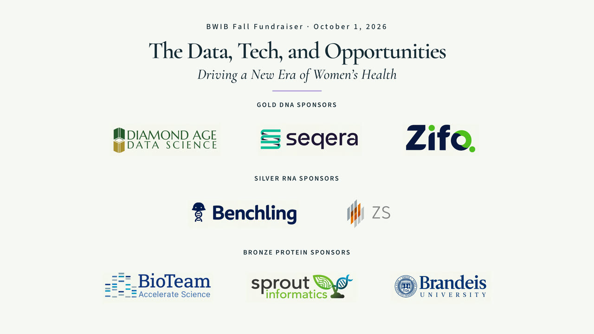

# Template still-image gallery

For [animated previews, see the main README](../README.md#template-gallery).
These higher-resolution frames are from the reusable templates. Panel examples are silent demos;
actual speaking emphasis, waveforms and captions are supplied for each recording.

## Logo opener

## Interview card

## Event and sponsors

## A · Airy Stage

## C · Editorial Spotlight

